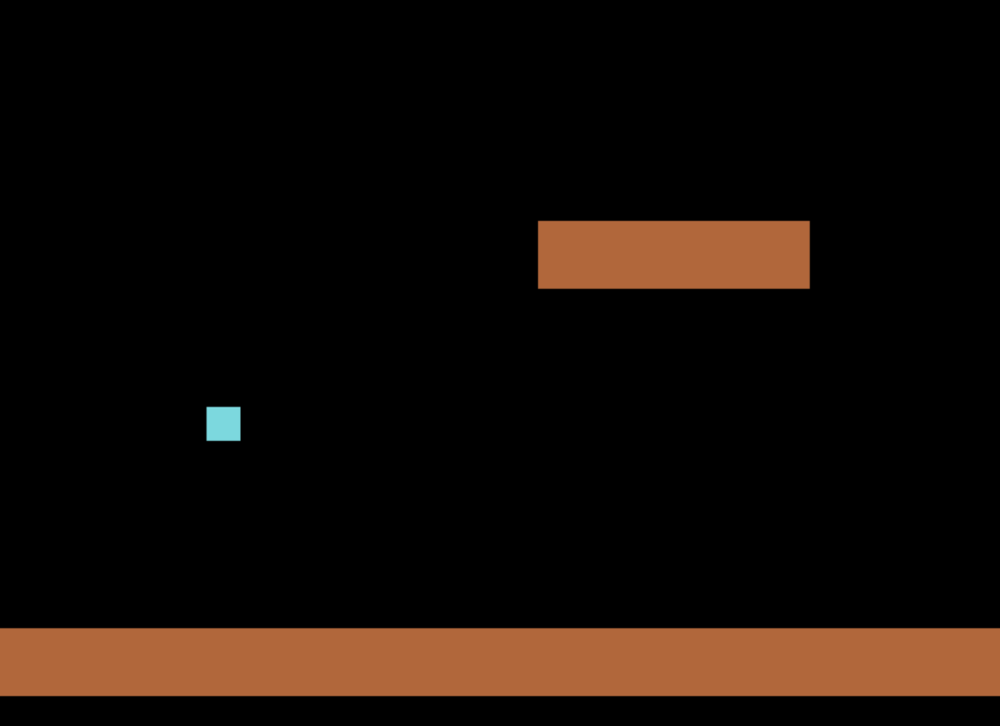
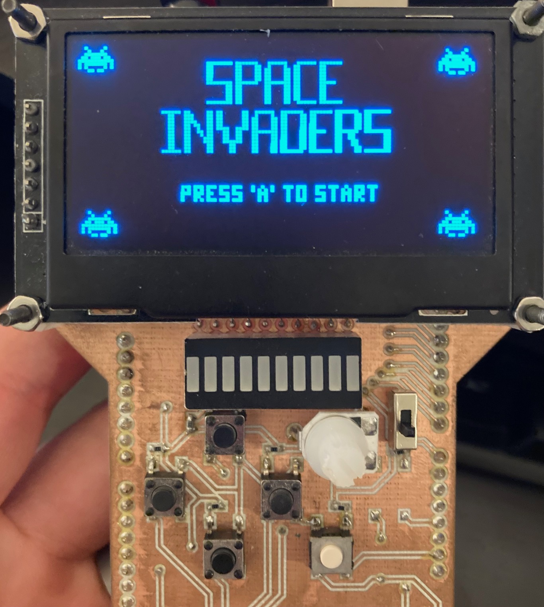
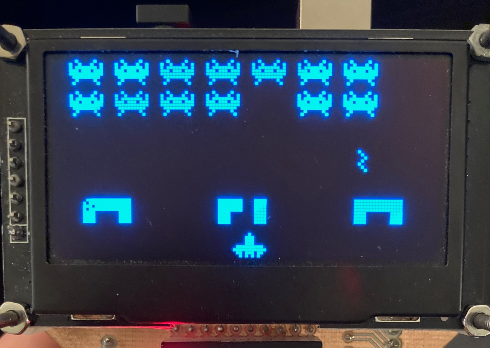

# A Stack Based Language
**Repo**: https://github.com/tcallred/a-stack-based-language

A simple programming language that is a mix between [APL](https://tryapl.org/) and [Forth](https://www.forth.com/forth/). 
The name is a tongue-in-cheek reference to the fact that APL simply stands for "A Programming Language".
The idea came from learning about APL and the ability it gives programmers to write quick terse operations on matrices. 
I thought that maybe a stack-based language with post-fix operators would make APL easier to interact with than its usual infix operators. 
The interpreter is implemented using [Rust](https://www.rust-lang.org/) and the [ndarray](https://crates.io/crates/ndarray) crate. 
It is currently usable as an advanced reverse-Polish calculator but it's pretty limited in terms of operations.
I have several features I would like to add to to it in the future and I want it to eventually have everything that APL has.  

```rust
A stack based programming language. Enjoy!

> 1 2 +
3

> 1 2 3
3
2
1

> 1 2 3 |
[[1.0, 2.0, 3.0,]]

> 1 2 3 | 5
5
[[1.0, 2.0, 3.0]]

> 1 2 3 | 5 *
[[5.0, 10.0, 15.0]]

> 1 2 3 | 5 * sum
30

Goodbye.
```

# Dragonball Live

**Repo**: https://github.com/tcallred/dragonball-live

Some friends and I used to play this simple rhythm game called "Dragonball" where the players clap on the beat and make different "moves" in sync. 
When you make a move you can "charge", "block", "kamehameha", etc. 
The goal is the kill off the other players and be the last one standing. 
It's basically rock-paper-scissors on steroids. 

I always wanted to turn this game into a browser-based multiplayer game in the spirit of scribbl.io. 
Being a huge fan of [Elixir](https://elixir-lang.org/), I discoverd [Phoenix](https://www.phoenixframework.org/) and [LiveView](https://hexdocs.pm/phoenix_live_view/Phoenix.LiveView.html) and thought that it could be a great fit for implementing this game. 
As of today, the game logic has been coded up and I am currently working on everything else. 
Stay tuned for more updates!

```elixir
defmodule Dragonball.Move do
  alias Dragonball.Player
  alias __MODULE__

  @type dragonball_move ::
          :charge
          | :block
          | :kamehameha
          | :disk
          | :super_saiyan
          | :reflect
          | :special_beam
          | :spirit_bomb

  @type t :: %Move{
          move_type: dragonball_move(),
          target: nil | Player.id_type()
        }

  defstruct move_type: :charge,
            target: nil


  def new(move_type, target \\ nil) do
    %Move{
      move_type: move_type,
      target: target
    }
  end

  def cost_of(%Move{move_type: move_type}) do
    case move_type do
      :charge -> 0
      :block -> 0
      :kamehameha -> 1
      :disk -> 2
      :super_saiyan -> 3
      :reflect -> 4
      :special_beam -> 5
      :spirit_bomb -> 10
    end
  end

  def move_priority(move_type) do
    case move_type do
      :kamehameha -> 1
      :disk -> 2
      :special_beam -> 3
      _ -> 0
    end
  end
end
```

# FloatTracker.jl
**Repo**: https://github.com/tcallred/FloatTracker.jl

This was my Master's project at the University of Utah. 

FloatTracker is a library providing types and functions for detecting and logging floating-point exceptions at runtime. 
Floating-point exceptions (like `NaN`) can often pop up in long-running scientific computing programs or even machine-learning pipelines. 
When they do, they usually make themselves known to the user but sometimes they silently cause incorrect results. 
FloatTracker aims to be a debugging tool to find where `NaN`s occur, how the flow through the program, and where they disappear. 

Using Julia for this project turned out to be a great idea. 
Utilizing its dynamic dispatch system and some meta programming, I was able to make a `TrackedFloat` type that disguised itself as a float.
A `TrackedFloat` walks like a float and talks like a float, but when it's used with any primitive operation, it calls our version of that operation which performs the exception detection and reporting. 
This lets us perform this dynamic analysis any code, even within an opaque library. 

```julia
using FloatTracker: TrackedFloat16, write_out_logs, set_logger

set_logger(filename="max", buffersize=1)

function maximum(lst)
  curr_max = 0.0
  for x in lst
    if curr_max < x 
      curr_max = x
    end
  end
  curr_max
end

function maximum2(lst)
  foldl(max, lst)
end
  
println("--- With less than ---")
# res = maximum([1, NaN, 4])
res = maximum([TrackedFloat16(x) for x in [1, NaN, 4]]).val
println("Result: $(res)")
println()

println("--- With builtin max ---")
# res2 = maximum2([1, NaN, 4])
res2 = maximum2([TrackedFloat16(x) for x in [1, NaN, 4]]).val
println("Result: $(res2)")

write_out_logs()
```

# Foust
**Repo**: https://github.com/tcallred/Foust

This was the final project for Prof. Flatt's "FP Studio" class where we did medium sized projects with functional programming languages. 

The purpose of this project was to use functional programming for something it doesn't often get used for. 
I decided that I would make a small game (the arcade game Joust) with [F#](https://fsharp.org/) and use [The Elm Architecture](https://guide.elm-lang.org/architecture/) as my inspiration. 

The experience turned out really well from a programmer enjoyment perspective. 
I managed to make an FRP engine and a game with working physics, controls, and collisions. 
It will be very interesting to try and experiment more with TEA in game development. 

```fsharp
module Game =

    open SDL
    open Engine

    let windowTitle = "Foust!"
    let windowWidth = 1000
    let windowHeight = 800

    let background =
        (Pixel.Color.fromRGBA (uint8 0, uint8 0, uint8 0, uint8 1))

    type Model =
        { Platforms: Platform list
          Player: Bird.Bird }

    let init =
        { Platforms =
            [ { Position = new Vector2(0.0F, 700.0F)
                Size = new Vector2(1000.0F, 50.0F) }
              { Position = new Vector2(400.0F, 400.0F)
                Size = new Vector2(200.0F, 50.0F) } ]
          Player =
            { Bird.default_bird with
                Player = true
                Position = new Vector2(500.0F, 100.0F) } }

    let update (state: Model) (input: Engine.UserInput) : Model =
        // Printf.printfn "%A" state.Player
        { state with
            Player =
                state.Player
                |> (fun player ->
                    if input.[ScanCode.Z] then
                        Bird.flap player
                    else
                        player)
                |> (fun player ->
                    if input.[ScanCode.Right] then
                        Bird.increase_speed player Bird.MoveDir.Right
                    else
                        player)
                |> (fun player ->
                    if input.[ScanCode.Left] then
                        Bird.increase_speed player Bird.MoveDir.Left
                    else
                        player)
                |> Bird.update_physics state.Platforms (windowWidth, windowHeight) }

    let display (state: Model) (renderer: Render.Renderer) : unit =
        let _ =
            renderer |> Render.setDrawColor background

        renderer |>* Render.clear

        let renderer = Bird.draw renderer state.Player

        List.fold Platform.draw renderer state.Platforms
        |>* Render.present
```



# Santorini 
**Repo**: https://github.com/tcallred/santorini

Another project for Dr. Flatt's "FP Studio". 

This is an implementation of an AI agent that plays the board game [Santorini](https://en.wikipedia.org/wiki/Santorini_(game)) written in [OCaml](https://ocaml.org/). 
It uses purely functional code, minimax alpha-beta pruning, and some pretty complex logic for handling the various "gods" that the players can choose. 
This project taught me a lot about separating logic into small functions and really *designing* those functions to assist my comprehension in the process. 
```ocaml
let rec minimax (board : Board.board) (prev_board : Board.board)
    maximizing_player alpha beta depth : Board.board option * int =
  if (depth = max_depth || win_condition board prev_board) && depth > 0 then
    (some board, evaluate_position board prev_board)
  else
    let player1, _ = board.players in
    let t1, t2 = player1.tokens in
    let moves =
      possible_action_seqs_for_tok t1 board player1.card
      @ possible_action_seqs_for_tok t2 board player1.card
      |> List.sort (fun a b -> List.length a - List.length b)
    in
    let best = (none, if maximizing_player then Int.min_int else Int.max_int) in
    best_move moves board best alpha beta maximizing_player depth
```

# GameDuino
**Repo**: https://github.com/connordo/GameDuino

This was a fun side project done by me and my friend Connor. 
He had made an Arduino shield with buttons and an LCD screen and together we coded up Space Invaders in C++. 
He took on more of the low level interfacing while I did the game logic and architecture. 
The experience was very rewarding and we both look back at what we accomplished fondly. 
It is very satisfying to get a working game running on such a small device.  




